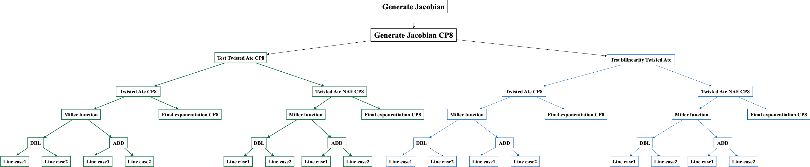

# Table of Content
- [General notes on genus 2 hyperelliptic curves](#general-notes-on-genus-2-hyperelliptic-curves)
- [Genus 2 pairings with embedding degree 8](#genus-2-pairings-with-embedding-degree-8)
- [Genus 2 pairings with embedding degree 16](#genus-2-pairings-with-embedding-degree-16)


# General notes on genus 2 hyperelliptic curves

Elliptic curves are genus 1 curves and in the context of cryptographic applications they are represented in short Weierstrass form over a prime field $\mathbb F_p$ as:

$$ E/\mathbb F_p: y^2 = f(x) $$

where $f(x) = x^3 + ax + b$. Note that the degree of the polynomial $f$ is $\deg(f) = 3$. 

A genus 2 hyperelliptic curve $C$ over a prime field $\mathbb F_p$ is represented by an equation of the form 

$$C/\mathbb F_p: y^2 = f(x)$$

where in the cases we are interested in, the polynomial $f$ has the form $f(x) = x^5 + ax^4 + bx^3 + cx^2 + dx + e$, hence has degree $\deg(f) = 5$ and coefficients in $\mathbb F_p$. 

In the case of elliptic curves, the set $E(\mathbb F_p)$ defines a group. 
That is, the set of all points on the curve, together with the point at infinity $\mathcal O$, forms a group and the operation in the group is point addition. 
We write this group as: 

$$ E(\mathbb F_p) = \lbrace P = (x, y) \in \mathbb F_p \times \mathbb F_p : y^2 \equiv (x^3 + ax + b) \bmod p \rbrace \cup \lbrace \mathcal O \rbrace $$

For genus 2 curves, we assume the same set; i.e. the set of all points $P = (x, y)$ that satisfy the equation of the genus 2 curve. 
This is written as follows:

$$ C(\mathbb F_p) = \lbrace P = (x, y) \in \mathbb F_p \times \mathbb F_p : y^2 \equiv f(x) \bmod p \rbrace \cup \lbrace \mathcal O \rbrace $$

The problem with genus 2 is that such a set **is not** a group. 
Then if we want to develop DLP-based protocols using genus 2 curves, we need a different object associated to the curve $C$. 
We call this *special* object the *Jacobian of a genus 2 curve* and we denoted as $J(\mathbb F_p)$.   

## The Jacobian 

The elements in the Jacobian **are not points on the curve**, but they are derived from two points on the curve. 
In particular, let $P_1 = (x_1, y_1)$ and $P_2 = (x_2, y_2)$ be two points on the curve $C$. 
We compute the polynomial $u(x)$ as: 

$$ u(x) = (x - x_1)(x - x_2) = x^2 - (x_1 + x_2)x + x_1x_2 = x^2 + u_1x + u_0 $$

where $u_1 = - (x_1 + x_2)$ and $u_0 = x_1x_2$. 
Then we search for a polynomial $v(x)$ such that it satisfies both relations: 

$$ v(x_1) = y_1 \quad \text{and} \quad v(x_2) = y_2 $$

Solving this system yields a polynomial $v(x) = v_1x + v_0$, where 

$$ v_1 = \dfrac{y_2 - y_1}{x_2 - x_1} \quad \text{and} \quad v_0 = \dfrac{(x_2 - x_1)y_1 - (y_2 - y_1)x_1}{x_2 - x_1} $$

Then the element $D = [u(x), v(x)]$ is an element in the Jacobian $J(\mathbb F_p)$. 
This representation $D = [u(x), v(x)]$ is called *Mumford representation*. 

So, when we choose a random point in the Jacobian $J(\mathbb F_p)$, this is actually a pair of polynomials $D = [u(x), v(x)]$ where each polynomial has coefficients in $\mathbb F_p$. 
A few remarks based on the above definition of Jacobian elements: 
- The polynomial $u(x)$ is *monic*. This means that the leading coefficient (in other words, the coefficient of $x^2$) will always be 1.
- The polynomial $u(x)$ divides the polynomial $f(x) - v(x)^2$.
- The degree of $u(x)$ is $\deg(u) \leq 2$ and the degree of $v(x)$ is $\deg(v) < \deg (u)$. In other words, the polynomial $u(x)$ can be quadratic, linear, or constant, while the polynomial $v(x)$ will always be one degree less than $u(x)$.

Using this representation of elements in a Jacobian $J(\mathbb F_p)$, we can define an addition law in $J(\mathbb F_p)$, making it a group. 

Now we study how to define pairings on Jacobians of genus 2 curves. 

# Genus 2 pairings with embedding degree 8



## Functions that will be implemented

For this example, we will need to implement the following functions which will be put in specific folders: 

- Function `generate_Jacobian_params_k8.py`. This function will generate the necessary parameters for the example of a genus 2 curve and its Jacobian with embedding degree 8. These include the equation of the genus 2 curve, the base field prime $p$, the Jacobian of the curve and it's order. It will also generate the required Jacobians over extension field $\mathbb F_{p^8}$, as well as the two elements $P$ and $Q$ for which the pairing will be computed.  

## Setup: Generating the Jacobian parameters

We describe the function `generate_Jacobian_params_k8.py`. 

### Generating the curve and Jacobian parameters

We consider a genus 2 hyperelliptic curve of the form:

$$ C/\mathbb F_p: y^2 = x^5 + 3x $$

defined over the prime field $\mathbb F_p$, where $p$ is given below. 
This particular curve has a Jacobian $J(\mathbb F_p)$ of composite order $n = hr$, where the cofactor $h$ and the prime $r$ are defined below. 

```r
//Curve and Jacobian parameters over Fp
p = 0x63757e4ba8c6ff6428754c24f70a9d3fe49534369f934a87b3bc1ff278656337cc69cee396a8ef98ad875836188ff0f293ae2a233bd903541cf070deadb7631ff5f27ad9
r = 0xff0060739e18d7594a978b0ab6ae4ce3dbfd52a9d00197603fffdf0000000101
h = 0x26cad1cf6fb1762e04b1549002acb3556aa8178f23bd901d1d01f940fb055fb7ca43e8b854a30786a394a65690a583fbb88c4c850a7fcf78daf75074603484a1c06a742ea4a9d002bf9b63808aeee5759acee12b509649987d7270d3c561273221ebfbba91d5a0c2
n = 0x26a4159b3400bfed201dba82df5c3f55f75b70984638ccda45d4079e5d3b97c8b78d2bb8fbff84726afe91c6c4112fb96ca0a1716c12a0eae299b835cd4c05623913386752579775193e447b5ebf1b530b78dc7b5bcfedfb337885eae68ea3a4b994ee7ea2a443d8c1daf95bc29d0b37b8037ae7968df83ff7c1a7a9523b6b78042eb44c677662c2
```
The prime $p$ in this example has a special form. It is written as $p = X^2 + 2Y^2$, where 

```r
X = 0x9f910b5ab8f0c95906b67d8867694eae3f74da06d105ba2a05e1a459b29c00a0d109
Y = 0x13ec07890859f0d2fdd0d79e517fb6f49886c959639a1ef72cc8fd885c000012e
```

The order of the Jacobian can be calculated with the *characteristic polynomial of Frobenius* denoted as $\chi(t)$. 
This polynomial has integer coefficients, hence $\chi(t) \in \mathbb Z[t]$ and it is defined as: 

$$ \chi(t) = t^4 + (4Y)t^3 + (8Y^2)t^2 + (4Yp)t + p^2 $$

Then the order $n$ of the Jacobian is computed as $n = \chi(1)$. In other words by evaluating the characteristic polynomial of Frobenius at 1.
Then we have: 

$$ n = \chi(1) = 1 + 4Y + 8Y^2 + 4Yp + p^2 $$

The cade in SageMath for computing the order of a Jacobian $J(\mathbb F_p)$ is as follows: 

```r
//SageMath code
Zx = ZZ['t']                                            //Define the ring of polynomials with integer coefficients
(t,) = Zx._first_ngens(1)          
xt = t**4 + 4*Y*t**3 + 8*Y**2*t**2 + 4*p*Y*t + p**2     //Define the characteristic polynomial of Frobenius \chi(t)
assert n == xt(t = 1)                                   //Check is the order is correct
```

### Constructing the curve and Jacobian over the base field $\mathbb F_p$

Based on these values, we can define in SageMath the base field $\mathbb F_p$, the equation of the hyperelliptic curve and its Jacobian with the following commands: 

```r
//SageMath code
Fp = GF(p, proof=False)              //Fix the prime field Fp
Fpx = Fp['x']                        //Fix Fpx as the ring of polynomials in x, with coefficients in Fp
(x,) = Fpx._first_ngens(1)
C = HyperellipticCurve(x**5 + 3*x)   //Set the equation of the hyperelliptic curve C
J = C.jacobian()                     //J is the Jacobian of the curve C
```
Note that the Jacobian $J$ is defined over $\mathbb F_p$ and hence the elements in $J(\mathbb F_p)$ will be defined over $\mathbb F_p$.
We can generate a random element $P$ in the Jacobian $J(\mathbb F_p)$ using the function `J_random_element()`. 
Based on the discussion in the previous section, a random element $P \in J(\mathbb F_p)$ will be of the form 

$$ P = [u(x), v(x)] = [x^2 + u_1x + u_0, v_1 x + v_0] $$

where $u_0, u_1, v_0, v_1$ are elements in $\mathbb F_p$. 
Recall that when choosing a random element in $J(\mathbb F_p)$, this element will have order $hr$. 
Then we need to make sure that the element $P$ has prime order $r$. 
We can ensure this by multiplying the point with the cofactor $h$. 
The resulting point will have order $r$ as needed. 

```r
//SageMath code
P = J_random_element(C)  //Pick random element in Jacobian J(Fp) 
P = h*P                  //Force P to have order r
```
### Constructing the curve and Jacobian over the extension field $\mathbb F_{p^8}$

In this example we are working with Jacobians with embedding degree 8. 
Then we need to define an extension field of degree 8. 

```r
//SageMath code
Fpw = Fp['w']                                  //Fpw: polynomial ring in w with coefficients in Fp
(w,) = Fpw._first_ngens(1)
Fp8 = Fp.extension(w ** 8 + 3, names=('w',))   //Fp8: degree 8 extension of Fp. 
(w,) = Fp8._first_ngens(1)
```
The above four lines define an extension of $\mathbb F_p$ of degree 8. This is essentially the field: 

$$ \mathbb F_{p^8} = \mathbb F_p[w]/\langle w^8 + 3 \rangle $$

Recall that this field contains all polynomials in $w$ with coefficients in $\mathbb F_p$ taken modulo the polynomial $w^8 + 3$.

Now we need to define the curve and its Jacobian over the extension field $\mathbb F_{p^8}$. 
We do this with the following commands:

```r
//SageMath code
Fp8x = Fp8['x']                                    //Fix Fp8x as the ring of polynomials in x, with coefficients in Fp^8
(x,) = Fp8x._first_ngens(1)    
C8 = HyperellipticCurve(Fp8x([0, 3, 0, 0, 0, 1]))  //Fix the equation of the curve over the extension field Fp8 as C8: y^2 = x^3 + 3x
J8 = C8.jacobian()                                 //J8 is the Jacobian of the curve C8, i.e. over the extension field Fp^8
```
We also need to compute the order of the Jacobian $J8(\mathbb F_{p^8})$. 
This can be done use the resultant of the polynomials $t^8 - 1$ and the characteristic polynomial of Frobenius. 
In particular, we use the following SageMath script.

```r
//SageMath code
Res = (t**8 - 1).resultant(xt)  //Compute the resultant  of the polynomials t^8 - 1 and \chi(t)
h' = Res // r**4                //Compute the cofactor of the Jacobian J8 
n' = h' * r                     //Compute the order of the Jacobian J8 
```
Now we need to pick a second element $Q$ from the Jacobian $J8(\mathbb F_{p^8})$. 
We do this again with the function `J_random_element()`. 
Note that such a random element $Q \in J8(\mathbb F_p)$ will be of the form 

$$ Q = [u'(x), v'(x)] = [x^2 + u'_1x + u'_0, v'_1 x + v'_0] $$

where $u'_0, u'_1, v'_0, v'_1$ are elements in the extension field $\mathbb F_{p^8}$.
```r
//SageMath code
Q = J_random_element(C8)  //Pick random element in Jacobian J8(Fp8) 
Q = h'*Q                  //Force Q to have order r
```
Note that picking a random element $Q$ from $J8(\mathbb F_{p^8})$ means that $Q$ will have order $h'r$, where $h'$ is the cofactor of the Jacobian $J8(\mathbb F_{p^8})$.
We can force $Q$ to have order $R$ by multiplying with the cofactor $h'$. 

### The length of the Miller loop

In this example the pairing we are going to use is the *twisted ate pairing*. 
In this case, the length of the Miller loop is defined by the parameter 

$$ T \equiv p \bmod r = \texttt{0xffc00020fffffffc} $$

This is a short integer as its size is $\log_2(T) = 64$-bits. 
This means that in the Miller loop we will need to perform 63 doubling steps. 
On the other hand, the hamming weight of $T$ will determine the number of the addition steps to be executed in the Miller loop and this integer $T$ has a relatively high hamming weight, particularly $\text{hw}(T) = 41$. 
This means that in the Miller loop we will need to perform 40 addition steps, which is quite expensive.
We can compute the hamming weight of an integer with the following function implemented in SageMath.
```r
// Hamming weight computation 
def hw(bit_x):                      // The input bit_x is the binary representartion of a positive integer
    count = 0
    for i in range(0, len(bit_x)):
        if bit_x[i] == 1:
            count = count + 1
    return count
```
Alternatively,  what we can do is use the *Non-Adjacent Form (NAF) representation* of the integer $T$. 
This is still a binary representation, but allowing also -1 to appear in the representation. 
Using the NAF representation, the integer $T$ can be written as follows: 

$$ T = \texttt{0xffc00020fffffffc} = 2^{64} - 2^{54} + 2^{37} + 2^{32} - 2^2 $$

The SageMath code for obtaining the NAF representation of a positive integer is the following. 

```r
// NAF representation of integer
def bits_2naf(x):                                            // Input is a positive integer x
    naf_x = []
    xx = Integer(x)
    assert x >= 0
    while xx > 0 :
        rr = xx % 4
        if rr == 3 :
            rr = -1
        else:
            rr = rr % 2
        naf_x.append(rr)
        xx -= rr
        xx,rr = xx.quo_rem(2)
        assert rr == 0
    assert x == sum([r*2**i for i,r in enumerate(naf_x)])
    return naf_x
```

The NAF representation of the integer $T$ has *NAF hamming weight* 5, meaning that we only need 4 addition steps in the Miller loop. 
Whenever the bit is 1 we add the element $Q$ and whenever the bit is -1 we add the element $-Q$. 
The SageMath code for calculating the NAF hamming weight of an integer is the following. 

```r
# NAF Hamming Weight
def naf_hw(naf_x):                              // The input naf_x is the NAF representartion of a positive integer
    count = 0
    for i in range(0, len(naf_x)):
        if (naf_x[i] == 1) or (naf_x[i] == -1):
            count = count + 1
    return count
```

### New coordinate system for Jacobian elements

Given an element $D$ in the Jacobian over any finite field, we need to use a specific coordinate system to be able to speedup the doubling and addition steps in the Miller loop. 
Recall that $D$ has the following form: 

$$ D = [x^2 + U_1x + U_0, V_1x + V_0] $$

Then we define the following 8-coordinate system for $D$: 

$$ D = [U_1, U_0, V_1, V_0, Z_1, Z_2, z_1, z_2] $$

where $z_1 = Z_1^2$ and $z_2 = Z_2^2$. The code in SageMath is: 

```r
// New coordinate system
def new_coordinates(D):
    U1, U0 = D[0][1], D[0][0]
    V1, V0 = D[1][1], D[1][0]
    Z1, Z2 = (1), (1)
    z1, z2 = (Z1**2), (Z2**2)
    D_ = [U1, U0, V1, V0, Z1, Z2, z1, z2]

    return D_
```

# Genus 2 pairings with embedding degree 16


